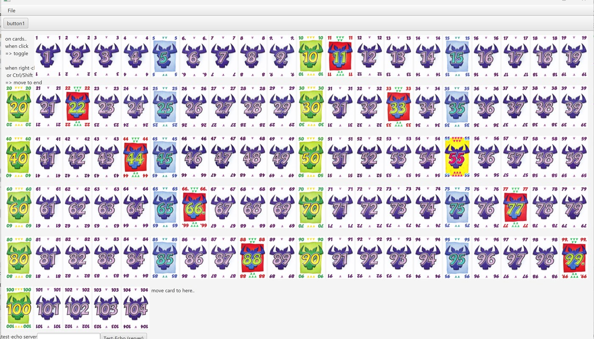
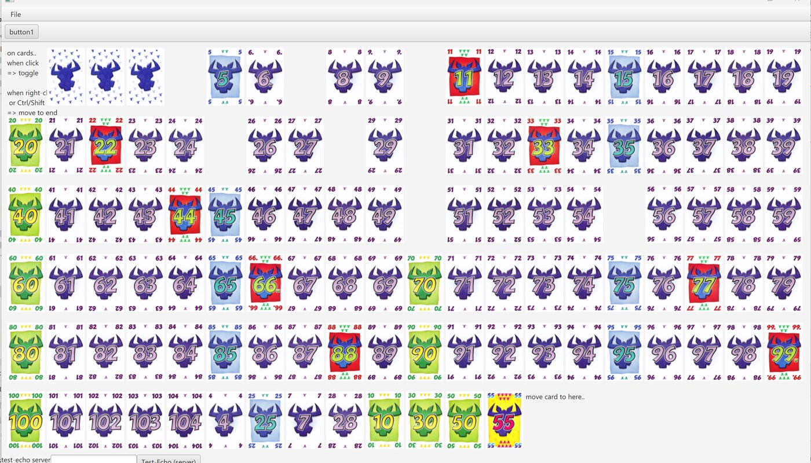

# le-6-qui-prend
java app for game "Le 6 qui prend"

# Skeleton App features

This is a skeleton White-App, for students to build their project starting from here.

When launching the client application, all cards are displayed in the center area.

You can click on any card, and it will toggle the front / back image.
You can also click with CNTRL button, and the card will be moved to the bottom-right position.

You can enter some text in the "echo-server" text edit, and click on "Test echo (server)" Button.
It will try to send a http request to and read response from the server, showing result.
This is done using a worker thread, so (correctly) not freezing the UI.

Here is a small video showing this

[doc/skeleton-app-client.mp4]

It implements few things:

## Maven multi-modules
This project is organized as a multi-modules maven project, for splitting common / client / server.

## The "common" maven module

It is the code shared between client and server.

It includes all the cards with their values.
Most of the classes are "DTO" (Data Transfer Object) classes.

They aim to be serializable in JSON format (the web standard) 
using jackson (java library for json)

## The "server" part 
using springboot http rest application

Of course, students are not obliged to do client-server app!!! 
But honestly, the game is meaningless if you see all cards of all players on a single screen.

For a detailed explanation of starting / testing / calling a Rest server, 
please see this repository, and follow the README documentation
[https://github.com/Arnaud-Nauwynck/javafx-client-server-whiteapp]

## The "client" part

It includes a basic testing GUI, showing cards with their front/back images.
  ( Image have been copied from [https://github.com/sandra-laduranti/6QuiPrend/tree/master/src/images/cards] )

It includes boilerplate code to call the server, using Worker thread

It also includes some sample layout of cards, and animations for moving cards.

